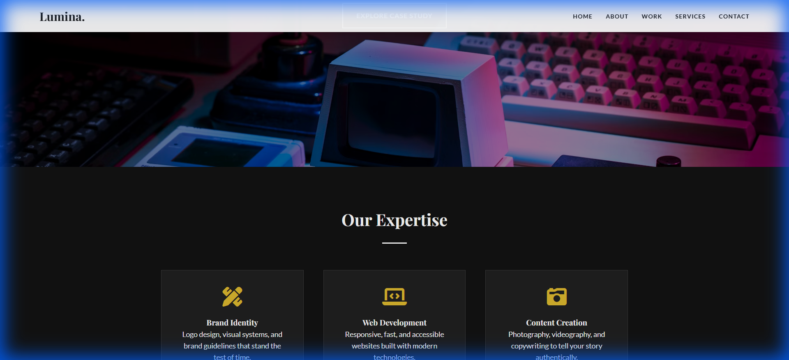
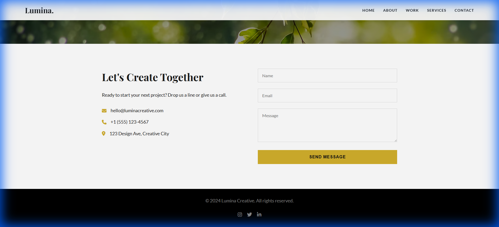

# Lumina Creative - Parallax Website

A visually immersive website designed for a creative agency, featuring smooth parallax scrolling effects where background content moves at a different speed than the foreground to create depth.



## 🚀 Features

- **Parallax Scrolling**: Background images in key sections stay fixed (`background-attachment: fixed`) while content scrolls, creating a 3D effect.
- **Smooth Navigation**: Custom JavaScript implementation for smooth scrolling to anchor links.
- **Scroll Reveal Animations**: Text and elements fade in and slide up as they enter the viewport using `IntersectionObserver`.
- **Responsive Design**: Fully fluid layout that adapts to mobile devices.
- **Interactive Navbar**: Navigation bar changes style on scroll and includes a mobile hamburger menu.

## 🛠️ Technologies Used

- **HTML5**: Semantic structure.
- **CSS3**: `background-attachment: fixed` for parallax, Flexbox/Grid for layout, and CSS variables.
- **JavaScript (Vanilla)**: For smooth scrolling, scroll observers, and mobile menu toggling.
- **Google Fonts**: 'Playfair Display' (Headings) and 'Lato' (Body).
- **Font Awesome**: Icons.

## 📂 Project Structure

```
parallax_website/
├── img/
│   ├── work_preview.png       # Screenshot of Work section
│   ├── contact_preview.png    # Screenshot of Contact section
│   └── mobile_preview.png     # Screenshot of Mobile view
├── index.html                 # Main HTML file
├── style.css                  # Styles and parallax CSS
├── script.js                  # Interaction logic
└── README.md                  # Project documentation
```

## 📸 Screenshots

### Desktop View

| Work Section                    | Contact Section                       |
| ------------------------------- | ------------------------------------- |
|  |  |

### Mobile View


## 📦 How to Run

1. Clone the repository or download the source code.
2. Open the `index.html` file in any modern web browser.
3. Scroll to experience the parallax effect!

---

© 2024 Lumina Creative. All rights reserved.
